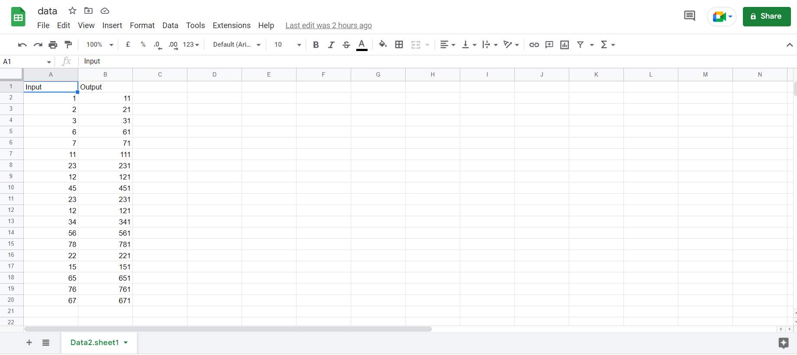
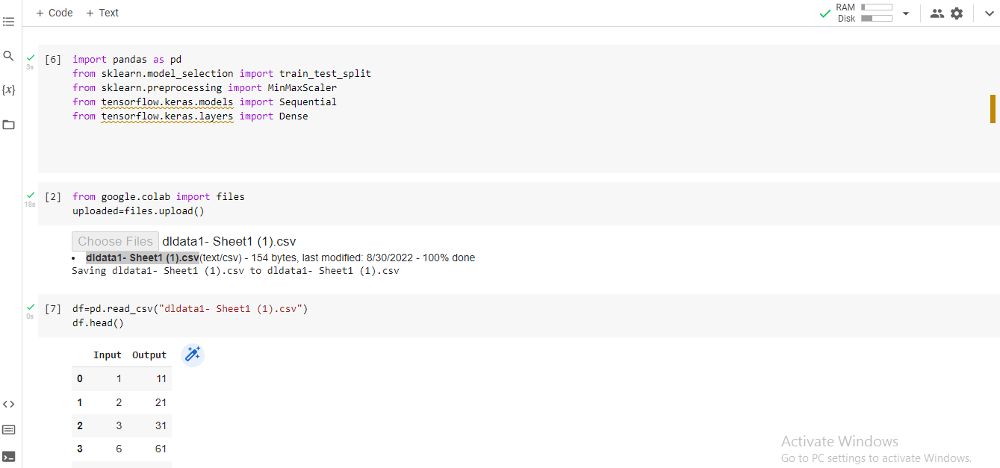
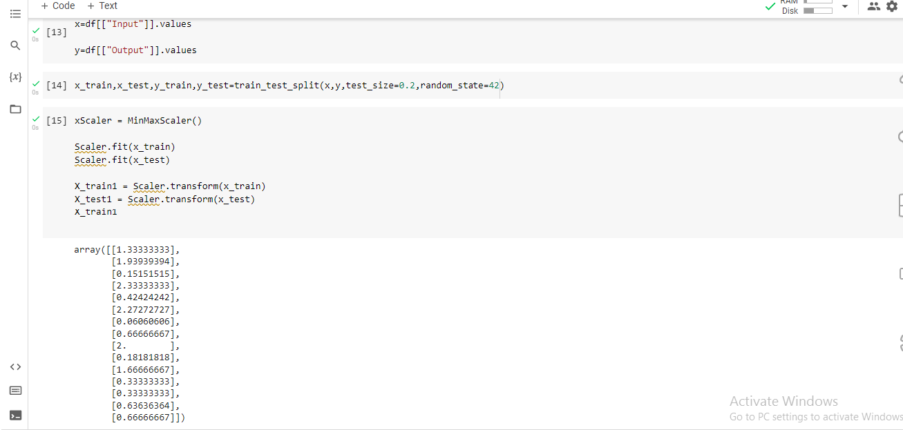
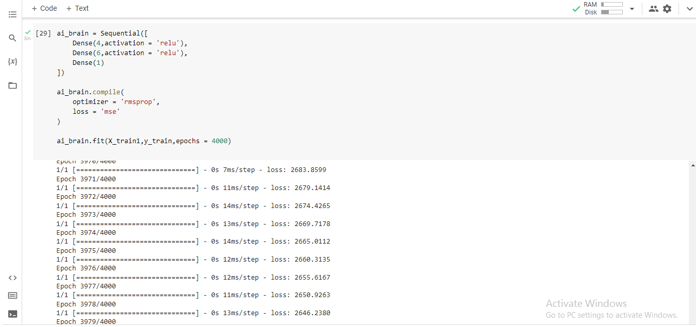
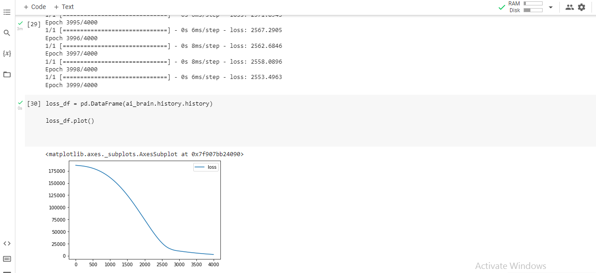
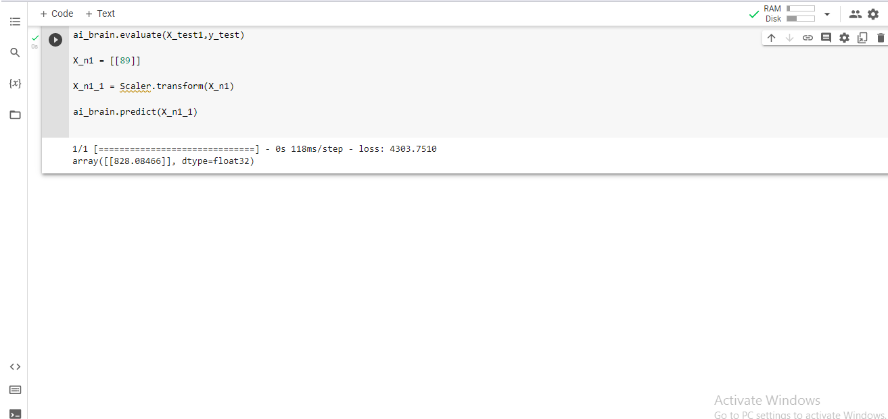
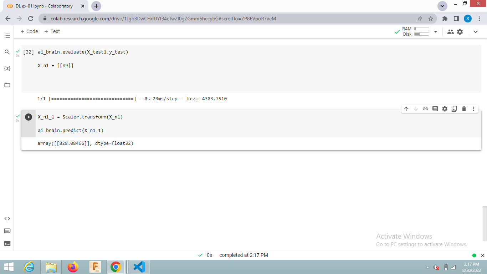

## Developing a Neural Network Regression Model

## AIM:

To develop a neural network regression model for the given dataset.
## THEORY:

Neural network regression is a supervised learning method, and therefore requires a tagged dataset, which includes a label column. Because a regression model predicts a numerical value, the label column must be a numerical data type. You can train the model by providing the model and the tagged dataset as an input to Train Model.
In this experiment we need to develop a Neural Network Regression Model so first we need to create a dataset (i.e : an excel file with some inputs as well as corresponding outputs).Then upload the sheet to drive then using corresponding code open the sheet and then import the required python libraries for porcessing.

The Neural Network model is a composition of Input layer, Hidden layers and Output layer. The below given model consists of 1 input layer, 2 hidden layers and 1 output layer. The input layer has 2 inputs in which the each inputs are linked to each of the units in the hidden layer 1 and each of the units in the hidden layer 1 is linked to that of the units in the hidden layer 2. And all those units of the 2nd hidden layer is linked to the outputs in the output layer. By the implementation of ReLU function, the below model is worked out.
## Neural Network Model:


## DESIGN STEPS:

### STEP 1:

Importing reqired python libraries for porcessing and loading the dataset.

### STEP 2:

Split the dataset into training and testing.

### STEP 3:

Create MinMaxScalar objects ,fit the model and transform the data.

### STEP 4:

Build the Neural Network Model and compile the model.

### STEP 5:

Train the model with the training data.

### STEP 6:

Plot the performance plot

### STEP 7:

Evaluate the model with the testing data.

## PROGRAM:

```
NAME: Silambarasan K
ROLL NO: 212221230101
Program to develop a neural network regression model..

### To Read CSV file from Google Drive :

from google.colab import auth
import gspread
from google.auth import default
import pandas as pd

### Authenticate User:

auth.authenticate_user()
creds, _ = default()
gc = gspread.authorize(creds)

### Open the Google Sheet and convert into DataFrame :

worksheet = gc.open('data').sheet1
rows = worksheet.get_all_values()
df = pd.DataFrame(rows[1:], columns = rows[0])
df = df.astype({'Input':'int','Output':'int'})

### Import the packages :

from sklearn.model_selection import train_test_split
from sklearn.preprocessing import MinMaxScaler
from tensorflow.keras.models import Sequential
from tensorflow.keras.layers import Dense

df.head()

X = df[['Input']].values
y = df[['Output']].values
X

### Split Training and testing set :

X_train,X_test,y_train,y_test = train_test_split(X,y,test_size = 0.33,random_state = 42)

### Pre-processing the data :

Scaler = MinMaxScaler()
Scaler.fit(X_train)
Scaler.fit(X_test)

X_train1 = Scaler.transform(X_train)
X_test1 = Scaler.transform(X_test)

X_train1

### Model :

ai_brain = Sequential([
    Dense(4,activation = 'relu'),
    Dense(6,activation = 'relu'),
    Dense(1)
])

ai_brain.compile(
    optimizer = 'rmsprop',
    loss = 'mse'
)

ai_brain.fit(X_train1,y_train,epochs = 4000)

### Loss plot :

loss_df = pd.DataFrame(ai_brain.history.history)

loss_df.plot()

### Testing with the test data and predicting the output :

ai_brain.evaluate(X_test1,y_test)

X_n1 = [[89]]

X_n1_1 = Scaler.transform(X_n1)

ai_brain.predict(X_n1_1)

```

## Dataset Information:



## OUTPUT
### Load and read dataset:



### Training Loss Vs Iteration Plot:



### Test Data Root Mean Squared Error:


### New Sample Data Prediction:

## RESULT:
Thus a neural network model for regression using the given dataset is written and executed successfully.
